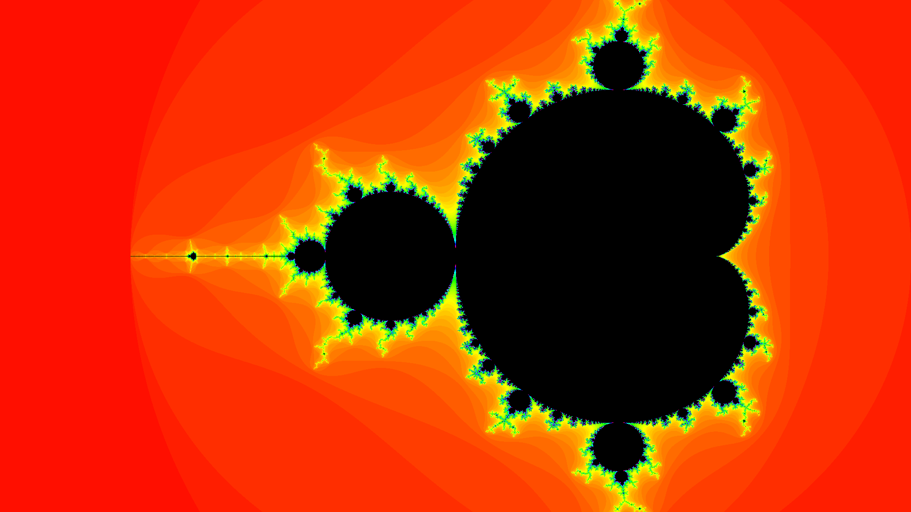
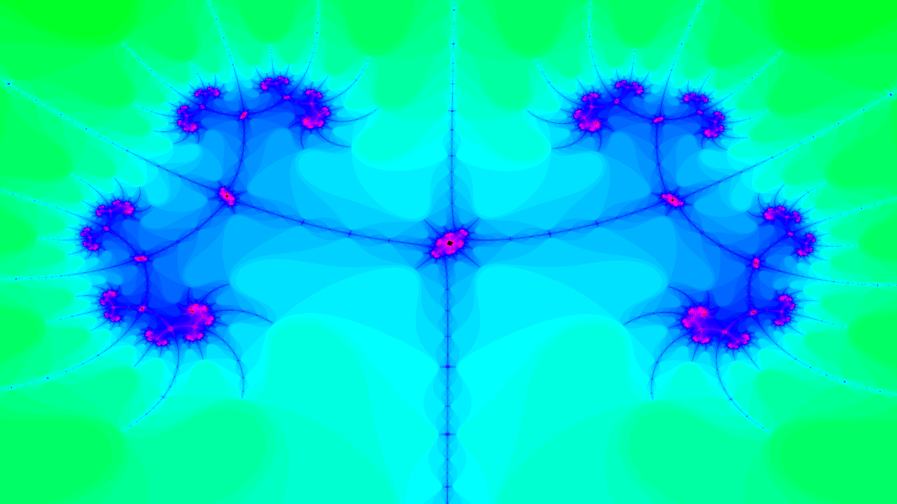

# mandelbrot-set

Generate an image of the mandelbrot set

## Usage

Compile with the usual `go build`

```bash
$ ./mandelbrot-set -h

Usage of ./mandelbrot-set:
  -color int
    	Color mode (use --help to see the available modes) (default 1)
  -height uint
    	Image height (default 1080)
  -help
    	Print a help message and exit
  -maxIterations uint
    	Maximum iteration count (default 100)
  -out string
    	The output image, maut be a png file (default "output.png")
  -width uint
    	Image width (default 1920)
  -xMaz float
    	Maximum value of X painted on the image (default 1)
  -xMin float
    	Minimum value of X painted on the image (default -2.5)
  -yMax float
    	Maximum value of X painted on the image (default 1)
  -yMin float
    	Minimum value of X painted on the image (default -1)

$ ./mandelbrot-set -help

This program generate an image of the mandelbrot set with the specified params (use -h to show them)
Available colors are "Gray Scale" (0) and "HUE" (1)
```

## Examples




